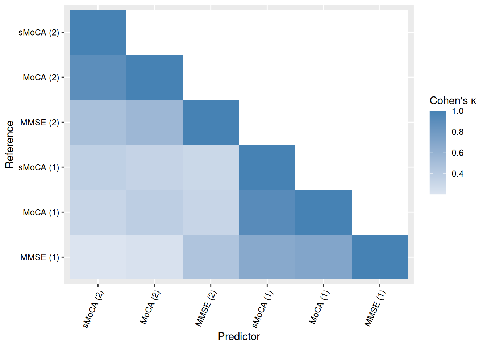
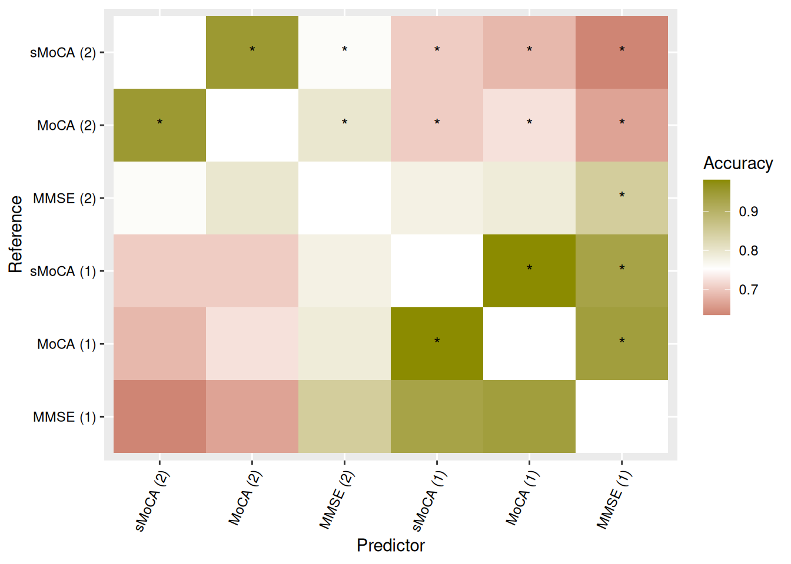
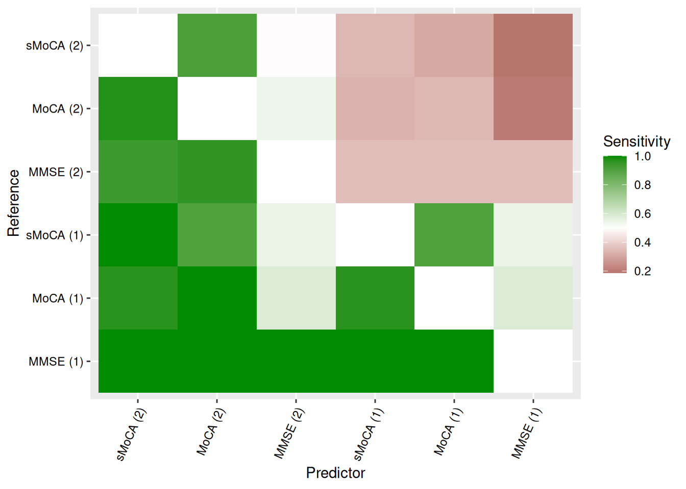
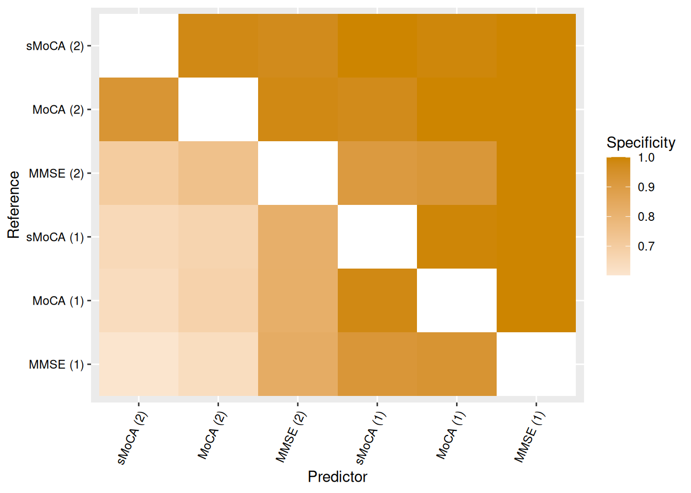

# Use \#2: Out of Pipeline

> If you do not have access to the raw data used in our article, you can
> still apply the key *demcrit* functions to your own, similarly
> structured dataset. In this vignette, we show how to do that using a
> small reproducible example.

Before you start, make sure you have a local installation of the
[demcrit](https://github.com/josefmana/demcrit.git) R package. If not,
see the [package overview](https://josefmana.github.io/demcrit/index.md)
for installation instructions.

## Setup

Start by loading the required packages:

``` r

library(demcrit)
library(gt) # for nicely formatted tables
library(tidyverse) |> suppressPackageStartupMessages() # For data wrangling
```

## Data Simulation

Because the original dataset cannot be shared, we will simulate a
similar dataset using built-in functions:

``` r

set.seed(87542) # for reproducibility
data <- simulate_pdd_data()
```

You can inspect the default parameters used in this simulation via:

``` r

prepare_defaults()
#> $Mu
#>   FAQ  MMSE  MoCA sMoCA 
#>  4.05 26.69 24.07 11.26 
#> 
#> $Sigma
#>             FAQ      MMSE      MoCA     sMoCA
#> FAQ   23.912100 -2.279718 -4.594644 -3.483636
#> MMSE  -2.279718  4.928400  4.867128  3.284712
#> MoCA  -4.594644  4.867128 12.110400  9.058440
#> sMoCA -3.483636  3.284712  9.058440  7.507600
#> 
#> $cens
#>       [,1] [,2]
#> FAQ      0   30
#> MMSE     0   30
#> MoCA     0   30
#> sMoCA    0   16
#> 
#> $crits
#>           IADL IADL_thres cognition cognition_thres
#> MMSE (1)   FAQ          7      MMSE              26
#> MMSE (2)  FAQ9          1      MMSE              26
#> MoCA (1)   FAQ          7      MoCA              26
#> MoCA (2)  FAQ9          1      MoCA              26
#> sMoCA (1)  FAQ          7     sMoCA              13
#> sMoCA (2) FAQ9          1     sMoCA              13
```

This produces the following example dataset:

    #> # A tibble: 1,218 × 8
    #>    id       FAQ  MMSE  MoCA sMoCA  FAQ9 type      PDD
    #>    <glue> <dbl> <dbl> <dbl> <dbl> <dbl> <chr>     <lgl>
    #>  1 s1         6    29    25    12     2 MMSE (1)  FALSE
    #>  2 s1         6    29    25    12     2 MMSE (2)  FALSE
    #>  3 s1         6    29    25    12     2 MoCA (1)  FALSE
    #>  4 s1         6    29    25    12     2 MoCA (2)  TRUE
    #>  5 s1         6    29    25    12     2 sMoCA (1) FALSE
    #>  6 s1         6    29    25    12     2 sMoCA (2) TRUE
    #>  7 s2        12    24    21     9     3 MMSE (1)  TRUE
    #>  8 s2        12    24    21     9     3 MMSE (2)  TRUE
    #>  9 s2        12    24    21     9     3 MoCA (1)  TRUE
    #> 10 s2        12    24    21     9     3 MoCA (2)  TRUE
    #> # ℹ 1,208 more rows

Key variables include:

- `id` – patient identifier
- `type` – diagnostic algorithm used
- `PDD` – diagnosis result for each patient–algorithm pair

For more details about how the data are generated, see:

``` r

help("simulate_pdd_data") # details on the data generation algorithm
help("prepare_defaults") # details on parameter defaults
```

## Dementia Rates

To compute dementia (PDD) rates, we first prepare a specification of
diagnostic algorithms and variable mappings. Then, we pass these to the
[`summarise_rates()`](https://josefmana.github.io/demcrit/reference/summarise_rates.md)
function:

``` r

# Extract default parameters:
pars <- prepare_defaults()

# Define algorithm specifications:
algos <- with(pars, {data.frame(
  type = rownames(crits),
  glob = crits$cognition, glob_t = crits$cognition_thres,
  iadl = crits$IADL, iadl_t = crits$IADL_thres,
  atte = "", atte_t = NA,
  exec = "", exec_t = NA,
  memo = "", memo_t = NA,
  cons = "", cons_t = NA,
  lang = "", lang_t = NA
)})

# Define variable names:
vars <- data.frame(
  name = c(unique(algos$glob), unique(algos$iadl)),
  label = c(unique(algos$glob), unique(algos$iadl)),
  type = "continuous"
)

# Compute PDD rates:
rates <- summarise_rates(
  list(PDD = data, algorithms = algos),
  vars = vars,
  plot = FALSE # Setting plot to FALSE bacause it is calibrated the data from the study..
)

# Format results:
tab1 <- rates$table |>
  select(type, Global, IADL, N, Rate) |>
  gt_apa_table() |>
  cols_label(
    type ~ "Algorithm",
    Global ~ "Cognitive deficit",
    IADL ~ "IADL deficit"
  )
```

|           |                   |              |     |             |
|:---------:|:-----------------:|:------------:|:---:|:-----------:|
| Algorithm | Cognitive deficit | IADL deficit |  N  |    Rate     |
| MMSE (1)  |    MMSE \< 26     |   FAQ \> 7   | 203 | 17 (8.37%)  |
| MMSE (2)  |    MMSE \< 26     |  FAQ9 \> 1   | 203 | 48 (23.65%) |
| MoCA (1)  |    MoCA \< 26     |   FAQ \> 7   | 203 | 29 (14.29%) |
| MoCA (2)  |    MoCA \< 26     |  FAQ9 \> 1   | 203 | 85 (41.87%) |
| sMoCA (1) |    sMoCA \< 13    |   FAQ \> 7   | 203 | 31 (15.27%) |
| sMoCA (2) |    sMoCA \< 13    |  FAQ9 \> 1   | 203 | 91 (44.83%) |

Table 1: An example table showing simulated PDD rates.

## Pairwise Concordance

Next, we can compute pairwise concordance statistics across algorithms:

``` r

concs <- describe_concordance(list(PDD = data, algorithms = algos))
```

For details about the resulting object, see:

``` r

help("describe_concordance")
help("concords") # describes the concordance statistics table
```

We can visualize concordance matrices for several metrics:



\(a\) Cohen’s kappa



\(b\) Raw accuracy



\(c\) Sensitivity



\(d\) Specificity

Figure 1: Concordance statistic matrices

Alternatively, we can extract specific concordance statistics and
present them in a table. Table [Table 2](#tbl-concordance) shows one
such example, with algorithms sorted by raw accuracy in predicting *MoCA
(1)*.

``` r

tab2 <- concs$table |>
  filter(reference == "MoCA (1)") |>
  filter(reference != predictor) |>
  arrange(desc(Accuracy_raw)) |>
  select(predictor, Kappa, Accuracy, NoInformationRate_raw, AccuracyPValue) |>
  mutate(AccuracyPValue = do_summary(AccuracyPValue, 3, "p")) |>
  gt_apa_table() |>
  fmt_number(decimals = 2) |>
  cols_label(
    predictor ~ "Predictor",
    NoInformationRate_raw ~ "NIR",
    AccuracyPValue ~ "p-value"
  )
```

|           |                     |                     |      |         |
|:---------:|:-------------------:|:-------------------:|:----:|:-------:|
| Predictor |        Kappa        |      Accuracy       | NIR  | p-value |
| sMoCA (1) | 0.92 \[0.85, 1.00\] | 0.98 \[0.95, 0.99\] | 0.86 | \< .001 |
| MMSE (1)  | 0.71 \[0.56, 0.86\] | 0.94 \[0.90, 0.97\] | 0.86 | \< .001 |
| MMSE (2)  | 0.32 \[0.17, 0.47\] | 0.79 \[0.73, 0.84\] | 0.86 |  .997   |
| MoCA (2)  | 0.38 \[0.27, 0.48\] | 0.72 \[0.66, 0.78\] | 0.86 |  1.000  |
| sMoCA (2) | 0.32 \[0.22, 0.42\] | 0.68 \[0.62, 0.75\] | 0.86 |  1.000  |

Table 2: Example table showing pairwise concordance statistics for five
algorithms sorted by raw accuracy in predicting MoCA (1). NIR stands for
*No Information Rate*, and p-values correspond to one-sided binomial
tests of Accuracy \> NIR.
